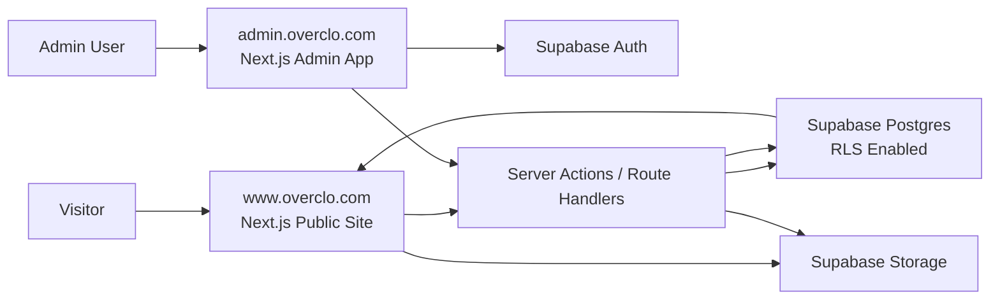

# Overclo Magazine Platform Plan

작성일: 2026-06-10

## 1. 목표

오버클로 홈페이지를 단순 정적 페이지에서 운영형 웹사이트로 전환하고, `Magazine` 섹션을 실제 게시글 관리, 댓글 관리, SEO 운영, 다중 관리자 권한이 가능한 CMS형 시스템으로 구축한다.

핵심 목표:

- 방문자는 `www.overclo.com/magazine`에서 매거진 글을 읽고 댓글을 남길 수 있다.
- 관리자는 `admin.overclo.com`에서 로그인 후 게시글, 댓글, 이미지, SEO, 사용자 권한을 관리한다.
- 게시글 내용이 디자인/마케팅/브랜딩/운영 등 어떤 주제여도 본문과 관리자가 입력한 정보를 기준으로 SEO 메타가 자동 생성된다.
- 관리자 여러 명, 트래픽 증가, 댓글 스팸, 권한 오남용, 비밀키 노출에 대비한 보안 구조를 처음부터 포함한다.

## 2. 서비스 구조

권장 도메인:

```text
방문자 사이트: https://www.overclo.com
관리자 사이트: https://admin.overclo.com
```

주요 URL:

```text
/
/portfolio
/magazine
/magazine/[slug]
/magazine/[slug]#comments
```

관리자 URL:

```text
https://admin.overclo.com/login
https://admin.overclo.com/dashboard
https://admin.overclo.com/posts
https://admin.overclo.com/posts/new
https://admin.overclo.com/posts/[id]/edit
https://admin.overclo.com/comments
https://admin.overclo.com/media
https://admin.overclo.com/users
https://admin.overclo.com/settings/seo
```

내비게이션 이름:

```text
ABOUT / PORTFOLIO / MAGAZINE / CONTACT
```

초기 버전에서는 매거진 내부 카테고리를 만들지 않는다. 대신 게시글 데이터에는 `primary_keyword`, `secondary_keywords`, `tags`를 저장해 두고, 글이 충분히 쌓인 뒤 카테고리 또는 태그 필터로 확장한다.

## 3. 권장 기술 스택

```text
Frontend/App: Next.js App Router
Hosting: Vercel
Database: Supabase Postgres
Auth: Supabase Auth
Storage: Supabase Storage
Admin UI: 별도 Next.js 앱 또는 같은 monorepo 내 admin app
Comments: Supabase Postgres + RLS + 승인제
SEO: Next.js Metadata API + server-side dynamic metadata
```

선택 이유:

- Next.js는 페이지별 메타데이터, 서버 렌더링, 정적 생성, 동적 라우팅을 함께 처리하기 좋다.
- Supabase는 Auth, Postgres, Storage, Row Level Security를 한 번에 제공한다.
- Vercel은 현재 배포 흐름과 잘 맞고, `www`와 `admin` 도메인 분리에 유리하다.

## 4. 전체 아키텍처



권장 배포 형태:

```text
overclo/
  apps/
    web/       # www.overclo.com
    admin/     # admin.overclo.com
  packages/
    db/        # database types, queries, migrations
    ui/        # 공유 UI 컴포넌트
    config/    # eslint, tsconfig 등
```

초기 구현 비용을 낮추고 싶다면 단일 Next.js 앱 안에서 `www`와 `admin` 라우트를 나누고, 배포 안정화 후 monorepo로 분리할 수 있다. 하지만 장기 운영과 보안 분리를 우선하면 `web`과 `admin` 앱 분리를 권장한다.

## 5. 관리자 접속 및 보안 모델

관리자 페이지는 `admin.overclo.com` 별도 주소로 운영한다.

로그인 정책:

- Supabase Auth 기반 이메일 로그인
- 관리자 초대 기반 계정 생성
- 일반 회원가입 비활성화
- MFA 적용 권장
- 관리자 세션은 HTTP-only secure cookie 기반 서버 검증
- 관리자 권한은 DB의 `admin_users` 또는 `profiles.role` 기준으로 검증

접근 제어:

- `admin.overclo.com` 전체는 인증 필요
- 로그인하지 않은 사용자는 `/login`만 접근 가능
- 로그인했지만 권한이 없는 계정은 접근 차단
- 모든 쓰기 작업은 서버에서 권한 재검증
- 브라우저에는 Supabase service role key를 절대 노출하지 않음

역할:

```text
owner
- 전체 권한
- 관리자 초대/삭제
- 보안 설정 변경
- 사이트 설정 변경

admin
- 게시글 발행/수정/삭제
- 댓글 승인/숨김/삭제
- SEO 수정
- 이미지 관리

editor
- 모든 게시글 작성/수정
- 발행 가능
- 댓글 검수 가능

writer
- 본인 게시글 작성/수정
- 임시저장 가능
- 발행 요청 가능

moderator
- 댓글 승인/숨김/삭제
```

초기 운영 권장:

```text
owner: 1명
admin: 1~2명
writer: 필요 시 추가
moderator: 댓글이 늘어난 뒤 추가
```

## 6. 주요 데이터 모델

### 6.1 admin_users

```text
id uuid primary key
auth_user_id uuid unique not null
email text not null
display_name text
role text not null
status text not null
invited_by uuid
last_login_at timestamptz
created_at timestamptz
updated_at timestamptz
```

### 6.2 posts

```text
id uuid primary key
slug text unique not null
title text not null
subtitle text
excerpt text
content jsonb not null
content_text text not null
status text not null
visibility text not null
author_id uuid not null
featured_image_id uuid
seo_title text
seo_description text
primary_keyword text
secondary_keywords text[]
og_title text
og_description text
og_image_id uuid
canonical_url text
is_featured boolean default false
published_at timestamptz
scheduled_at timestamptz
created_at timestamptz
updated_at timestamptz
deleted_at timestamptz
```

상태:

```text
draft
review
scheduled
published
private
archived
```

### 6.3 post_revisions

```text
id uuid primary key
post_id uuid not null
editor_id uuid not null
snapshot jsonb not null
change_summary text
created_at timestamptz
```

### 6.4 comments

```text
id uuid primary key
post_id uuid not null
parent_id uuid
author_name text not null
author_email text
author_password_hash text
content text not null
status text not null
ip_hash text
user_agent_hash text
approved_by uuid
approved_at timestamptz
created_at timestamptz
updated_at timestamptz
deleted_at timestamptz
```

댓글 상태:

```text
pending
approved
hidden
spam
deleted
```

### 6.5 media_assets

```text
id uuid primary key
storage_path text not null
public_url text
file_name text not null
mime_type text not null
file_size integer
width integer
height integer
alt_text text
uploaded_by uuid
created_at timestamptz
```

### 6.6 seo_audit_logs

```text
id uuid primary key
post_id uuid not null
score integer
warnings jsonb
suggestions jsonb
created_at timestamptz
```

## 7. 게시글 관리 기능

필수:

- 게시글 목록
- 작성/수정/삭제
- 임시저장
- 발행
- 비공개
- 예약 발행
- 대표 이미지 업로드
- 본문 이미지 업로드
- 작성자 선택
- SEO 자동 생성
- SEO 수동 수정
- 발행 전 미리보기
- 수정 이력 저장

확장:

- 글 검색
- 상태별 필터
- 작성자별 필터
- 추천글 고정
- 홈 노출 여부
- 매거진 상단 고정
- 관련 글 수동 지정
- RSS 생성

## 8. SEO 자동화 설계

SEO는 특정 고정 키워드를 강제로 넣지 않는다. 게시글 내용과 관리자가 입력한 힌트를 기준으로 자동 제안하고, 관리자가 최종 수정한다.

입력값:

```text
title
subtitle
excerpt
content_text
primary_keyword
secondary_keywords
featured_image.alt_text
published_at
updated_at
author
```

자동 생성 항목:

```text
seo_title
seo_description
slug
og_title
og_description
image_alt
canonical_url
structured_data
```

SEO 점검 규칙:

```text
title이 비어 있지 않은가
seo_title 길이가 과도하게 길지 않은가
seo_description이 존재하는가
canonical_url이 현재 slug와 일치하는가
대표 이미지가 있는가
대표 이미지 alt가 있는가
본문 첫 문단이 주제를 명확히 설명하는가
H1은 한 개만 존재하는가
내부 링크가 존재하는가
발행일과 수정일이 구조화 데이터에 포함되는가
sitemap에 포함되는가
```

구조화 데이터:

```text
Article
BreadcrumbList
Organization
ImageObject
```

페이지별 메타:

- `/magazine`: CollectionPage 또는 WebPage 성격의 메타
- `/magazine/[slug]`: Article 메타
- 댓글 영역은 색인 대상 콘텐츠로 과도하게 의존하지 않음

## 9. 댓글 기능 설계

초기 댓글 정책은 승인제다.

방문자 흐름:

```text
댓글 작성
스팸 방지 검사
pending 저장
관리자 알림
관리자 승인
approved 댓글만 공개 노출
```

관리자 기능:

- 댓글 목록
- 승인 대기 필터
- 게시글별 필터
- 승인
- 숨김
- 스팸 처리
- 삭제
- IP/user-agent 해시 기반 반복 스팸 탐지

보안:

- 댓글 본문 HTML 허용 금지
- 서버에서 sanitize
- rate limit 적용
- honeypot 필드 적용
- 비정상 요청은 captcha 또는 차단 후보로 기록
- 개인정보 최소 수집

## 10. 보안 설계

필수 원칙:

- Supabase service role key는 서버 환경변수에만 저장하고 브라우저에 노출하지 않는다.
- public schema의 모든 쓰기 테이블은 RLS를 활성화한다.
- 관리자 권한은 클라이언트 UI가 아니라 서버와 DB 정책에서 검증한다.
- 권한 정보는 사용자가 수정 가능한 user metadata가 아니라 DB 또는 app metadata 기준으로 관리한다.
- 이미지 업로드는 MIME, 확장자, 파일 크기, 이미지 크기를 검증한다.
- 관리자 액션은 audit log로 남긴다.

RLS 기준:

```text
posts
- anon: published + visibility public 글만 select
- authenticated admin: role에 따라 select/insert/update/delete

comments
- anon: approved 댓글만 select
- anon: insert는 pending으로만 가능
- admin/moderator: 상태 변경 가능

media_assets
- anon: public asset만 select
- admin/editor/writer: 업로드 가능
```

추가 보안:

- 관리자 MFA
- 관리자 초대 토큰 만료
- 로그인 실패 제한
- 서버 로그에 비밀키/개인정보 기록 금지
- CORS 도메인 제한
- CSP 헤더 적용
- 관리자 서브도메인 robots noindex
- 정기 백업
- DB migration 리뷰

## 11. 성능 및 확장 대비

방문자 증가 대비:

- 매거진 목록은 페이지네이션 또는 cursor pagination 적용
- 게시글 상세는 캐싱 적용
- 인기 글/최신 글 쿼리는 인덱스 적용
- 댓글은 초기 20개 로드 후 더보기
- 이미지 최적화와 lazy loading 적용

DB 인덱스:

```text
posts(slug)
posts(status, published_at desc)
posts(author_id)
comments(post_id, status, created_at desc)
comments(status, created_at desc)
admin_users(auth_user_id)
```

## 12. 마이그레이션 계획

1단계: 기반 전환

- Next.js 프로젝트 생성
- 기존 홈/포트폴리오 HTML을 컴포넌트화
- 기존 URL 유지
- Vercel 배포 확인

2단계: 데이터베이스/인증

- Supabase 프로젝트 생성
- Auth 설정
- 관리자 테이블과 RLS 정책 작성
- owner 계정 생성

3단계: 매거진 공개 페이지

- `/magazine` 목록
- `/magazine/[slug]` 상세
- SEO 메타
- sitemap/RSS

4단계: 관리자

- `admin.overclo.com` 연결
- 로그인
- 게시글 CRUD
- 미리보기
- 이미지 업로드

5단계: 댓글

- 댓글 작성
- 승인 대기
- 관리자 검수
- 승인 댓글 노출

6단계: 보안/운영 고도화

- audit log
- rate limit
- MFA
- 백업
- Search Console/Naver Search Advisor 제출

## 13. 오픈 전 체크리스트

- 기존 URL 리다이렉트 유지
- `/`, `/portfolio`, `/magazine` 정상 접근
- `admin.overclo.com` 비로그인 접근 차단
- service role key 브라우저 번들 미포함 확인
- RLS 전체 테이블 적용 확인
- 댓글은 승인 전 비노출 확인
- sitemap에 발행 글만 포함
- private/draft 글 noindex 처리
- OG 이미지 정상 표시
- Search Console 제출
- Naver Search Advisor 제출
- 백업 정책 확인

## 14. 참고 기준

- Supabase Row Level Security: https://supabase.com/docs/guides/database/postgres/row-level-security
- Supabase Auth with Next.js: https://supabase.com/docs/guides/auth/quickstarts/nextjs
- Supabase Auth: https://supabase.com/docs/guides/auth/
- Vercel Sensitive Environment Variables: https://vercel.com/docs/environment-variables/sensitive-environment-variables
- Next.js Authentication Guide: https://nextjs.org/docs/app/guides/authentication
- Google SEO Starter Guide: https://developers.google.com/search/docs/fundamentals/seo-starter-guide
