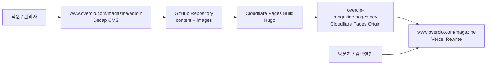

# Overclo Magazine Platform Plan

작성일: 2026-06-10
최종 변경: 2026-06-10

## 1. 계획 변경 요약

오버클로 매거진은 기존 홈페이지 전체를 Next.js 같은 JS 앱으로 전환하지 않고, 현재 정적 홈페이지 구조를 유지한 상태에서 `www.overclo.com/magazine` 경로 아래에 붙여 운영한다.

핵심 방향:

- 기존 `index.html`, `portfolio.html`, `renewal/`, `image_overclo/` 구조는 보존한다.
- 기존 로컬 확인 방식인 `http://127.0.0.1:5500/index.html`이 깨지지 않게 한다.
- 매거진은 사용자에게 `https://www.overclo.com/magazine` 주소로 노출한다.
- 관리자는 `https://www.overclo.com/magazine/admin`에서 글을 작성하고 발행한다.
- 글과 이미지는 GitHub 저장소에 남겨 오버클로가 콘텐츠 자산을 직접 보유한다.
- 운영 비용은 최대한 0원으로 유지한다.
- Cloudflare Pages는 매거진 원본 호스팅으로만 사용하고, Vercel rewrite로 메인 도메인 아래에 연결한다.
- 향후 필요하면 댓글, 카테고리, 검색, AI SEO 제안을 단계적으로 추가한다.

## 2. 목표

매거진의 목적은 단순히 블로그처럼 보이는 페이지를 만드는 것이 아니라, 오버클로의 SEO 자산을 지속적으로 축적하고 구글이 오버클로 관련 정보를 계속 수집할 수 있게 만드는 것이다. 이를 통해 향후 메타 광고 집행 시 브랜드 신뢰도, 검색 노출, 랜딩 후 탐색 경험을 보강한다.

운영 목표:

- 개발 지식이 없는 직원도 관리자 화면에서 글을 작성, 저장, 발행할 수 있다.
- 게시글 내용에 맞는 SEO 메타가 자동 생성되고, 관리자가 직접 수정할 수 있다.
- 대표 이미지, 본문 이미지, 제목, 요약, 발행 상태를 직관적으로 관리한다.
- 비용을 들이지 않고 GitHub와 무료 배포 서비스를 중심으로 운영한다.
- 트래픽이 급격히 많지 않을 것으로 예상되므로 DB 기반 대형 CMS보다 정적 생성 방식을 우선한다.

## 3. 권장 도메인 구조

```text
기존 홈페이지: https://www.overclo.com
매거진: https://www.overclo.com/magazine
게시글: https://www.overclo.com/magazine/[slug]
관리자: https://www.overclo.com/magazine/admin
Cloudflare 원본: https://overclo-magazine.pages.dev
```

별도 도메인을 구입하지 않는다. `magazine.overclo.com` 서브도메인도 초기 운영에서는 연결하지 않는다.

Cloudflare Pages 프로젝트는 `overclo-magazine.pages.dev` 원본 주소를 제공하고, Vercel의 external rewrite가 `/magazine` 요청을 이 원본으로 전달한다. 방문자 주소창에는 계속 `www.overclo.com/magazine`이 표시된다.

## 4. 권장 기술 스택

```text
Site Generator: Hugo
Hosting: Cloudflare Pages Free
Content Storage: GitHub Repository
Admin CMS: Decap CMS
Auth: GitHub 기반 또는 Cloudflare Access/Pages Functions 보강
Images: Repository 또는 Cloudflare Pages static assets
SEO: Hugo templates + front matter + build-time sitemap/RSS
Comments: 1차 제외, 추후 Giscus 또는 별도 승인형 댓글 검토
```

선택 이유:

- Hugo는 빠르고 정적 파일 생성에 강해 유지 비용이 낮다.
- Cloudflare Pages는 무료 범위가 넓고 정적 사이트 운영에 적합하다.
- GitHub에 글과 이미지를 저장하면 오버클로가 콘텐츠 원본을 직접 보유한다.
- Decap CMS를 붙이면 직원이 Markdown 파일을 직접 다루지 않고 관리자 화면에서 글을 작성할 수 있다.
- 기존 홈페이지를 전면 JS 앱으로 바꾸지 않아도 된다.

## 5. 전체 아키텍처



글 발행 흐름:

```text
1. 직원이 www.overclo.com/magazine/admin 접속
2. 로그인
3. 새 글 작성
4. 제목, 요약, 대표 이미지, 본문 입력
5. SEO 제목/설명 자동 생성값 확인 및 필요 시 수정
6. 임시저장 또는 발행
7. Decap CMS가 GitHub에 변경사항 저장
8. Cloudflare Pages가 자동 빌드
9. www.overclo.com/magazine에 반영
```

## 6. 프로젝트 구조

권장 구조:

```text
overclo/
  index.html
  portfolio.html
  renewal/
  image_overclo/
  docs/
  magazine-site/
    config.toml
    content/
      posts/
    layouts/
      _default/
      partials/
    static/
      admin/
        index.html
        config.yml
      uploads/
    assets/
```

원칙:

- 기존 루트 정적 사이트 파일은 이동하지 않는다.
- 매거진 관련 파일은 `magazine-site/` 안에 격리한다.
- Cloudflare Pages는 `magazine-site/`를 빌드 루트로 사용한다.
- 기존 홈페이지 배포와 매거진 배포를 분리한다.

## 7. 관리자 화면 설계

관리자는 별도 주소에서 접속한다.

```text
https://www.overclo.com/magazine/admin
```

관리자 메뉴:

```text
글 목록
새 글 작성
임시저장 글
발행된 글
이미지 관리
사이트 설정
```

글 작성 필드:

```text
제목
URL 주소(slug)
요약
대표 이미지
대표 이미지 설명(alt)
본문
SEO 제목
SEO 설명
공개 여부
발행일
작성자
```

직원에게 보이는 작업 방식은 티스토리 같은 블로그 관리자에 가깝게 구성한다. 개발자가 Markdown 파일을 직접 수정하는 방식은 운영 방식으로 삼지 않는다.

## 8. 콘텐츠 데이터 구조

게시글은 Markdown 파일과 front matter로 저장한다.

예시:

```yaml
---
title: "브랜드 리뉴얼 전 확인해야 할 것"
slug: "brand-renewal-checklist"
description: "브랜드 리뉴얼을 준비할 때 점검해야 할 핵심 요소를 정리합니다."
date: 2026-06-10
lastmod: 2026-06-10
draft: false
author: "Overclo"
featured_image: "/uploads/brand-renewal-checklist.png"
featured_image_alt: "브랜드 리뉴얼 체크리스트 이미지"
seo_title: "브랜드 리뉴얼 전 확인해야 할 핵심 체크리스트"
seo_description: "브랜드 리뉴얼을 준비하는 기업이 점검해야 할 목표, 고객, 시각 시스템, 콘텐츠 구조를 정리했습니다."
tags: []
---
```

초기에는 내부 카테고리를 만들지 않는다. 필요하면 나중에 `categories` 또는 `tags`를 추가한다.

## 9. SEO 자동화 설계

SEO는 글 내용에 맞게 자동 생성하되, 관리자가 수정할 수 있게 한다.

자동 생성 기준:

```text
seo_title:
  관리자가 입력한 SEO 제목 우선
  없으면 게시글 제목 사용

seo_description:
  관리자가 입력한 SEO 설명 우선
  없으면 요약문 사용
  요약문도 없으면 본문 첫 문단을 기반으로 생성

slug:
  관리자가 입력한 URL 우선
  없으면 제목을 영문/숫자/하이픈 형태로 변환

og_image:
  게시글 대표 이미지 우선
  없으면 사이트 기본 대표 이미지 사용

canonical:
  https://www.overclo.com/magazine/[slug]
```

자동 생성 항목:

```text
title
description
canonical
og:title
og:description
og:image
twitter:title
twitter:description
twitter:image
Article JSON-LD
BreadcrumbList JSON-LD
sitemap.xml
rss.xml
robots.txt
```

SEO 운영 원칙:

- 글 내용과 맞지 않는 키워드를 억지로 넣지 않는다.
- 검색량 높은 키워드는 발행 후 Google Search Console 데이터를 보고 개선한다.
- 초기 자동화는 본문 기반 메타 생성과 점검에 집중한다.
- 추후 Search Console 데이터가 쌓이면 제목, 설명, 내부 링크를 개선한다.

## 10. 댓글 기능 계획

댓글은 1차 제작 범위에서 제외한다.

이유:

- 무료 정적 매거진의 단순성과 보안을 우선한다.
- 댓글은 스팸, 개인정보, 승인 관리, 저장소 관리 이슈가 생긴다.
- 매거진 목적이 커뮤니티 운영보다 SEO 자산 축적에 가깝다.

추후 옵션:

```text
Giscus:
  GitHub Discussions 기반 무료 댓글
  장점: 무료, 관리 쉬움
  단점: 방문자가 GitHub 로그인이 필요할 수 있음

별도 승인형 댓글:
  Cloudflare Workers/D1 또는 Supabase Free 사용
  장점: 자체 댓글 운영 가능
  단점: 구현과 보안 관리가 증가
```

댓글을 추가할 경우 기본 정책은 승인제로 한다.

## 11. 보안 설계

관리자 보안:

- 관리자 URL은 `www.overclo.com/magazine/admin`으로 둔다.
- GitHub 저장소 쓰기 권한이 있는 관리자만 글을 발행할 수 있게 한다.
- 불필요한 공개 회원가입을 허용하지 않는다.
- 관리자 계정에는 2FA를 적용한다.
- Decap CMS 설정 파일에 민감키를 직접 저장하지 않는다.

저장소 보안:

- GitHub 권한은 최소 인원에게만 부여한다.
- 발행 담당자와 소유자 권한을 구분한다.
- 메인 브랜치 보호 규칙은 필요 시 적용한다.
- 관리자 변경 이력은 Git commit history로 추적한다.

공개 사이트 보안:

- 정적 사이트이므로 서버 공격면이 작다.
- 관리자 페이지는 검색엔진에 노출하지 않는다.
- 업로드 가능한 이미지 확장자와 크기를 제한한다.
- 외부 스크립트는 최소화한다.

## 12. 배포 설계

Cloudflare Pages 설정:

```text
Project name: overclo-magazine
Production branch: main
Root directory: magazine-site
Build command: hugo --minify
Build output directory: public
Custom domain: 사용하지 않음
```

Vercel rewrite:

```text
/magazine -> https://overclo-magazine.pages.dev/
/magazine/:path* -> https://overclo-magazine.pages.dev/:path*
```

Cloudflare Pages는 별도 원본으로만 사용한다. 사용자에게 노출되는 주소는 `www.overclo.com/magazine`이다. 기존 홈페이지 정적 파일은 이동하지 않는다.

## 13. 작업 단계

### Phase 1. 문서 및 구조 정리

- 계획서와 작업 가이드를 무료 정적 매거진 방식으로 수정
- 기존 Next/Supabase 전환 계획은 보류
- 기존 홈페이지 보존 원칙 재확인

### Phase 2. 매거진 기본 프로젝트 생성

- `magazine-site/` 생성
- Hugo 설정
- 기본 레이아웃
- 매거진 목록 페이지
- 게시글 상세 페이지
- 기본 샘플 글

### Phase 3. SEO 템플릿

- 페이지별 title/description
- OG/Twitter 메타
- Article JSON-LD
- sitemap/RSS
- robots.txt

### Phase 4. 관리자 CMS

- Decap CMS 설정
- `/admin` 페이지
- 글 작성 필드 구성
- 대표 이미지 업로드 설정
- 임시저장/발행 흐름 확인

### Phase 5. 로컬 검수

- 기존 `index.html` 로컬 구조 정상 확인
- 매거진 로컬 빌드 확인
- 생성된 HTML 메타 확인
- 모바일/데스크톱 화면 확인

### Phase 6. 배포 연결

- Cloudflare Pages 프로젝트 생성
- `www.overclo.com/magazine` rewrite 연결
- GitHub 자동 배포 확인
- Search Console 속성 추가
- sitemap 제출

## 14. 오픈 전 체크리스트

기존 홈페이지:

```text
index.html 로컬 확인 정상
portfolio.html 로컬 확인 정상
renewal 이미지 경로 정상
기존 OG 이미지 설정 유지
기존 GitHub 공유 구조 유지
```

매거진:

```text
www.overclo.com/magazine 접속 정상
게시글 목록 정상
게시글 상세 정상
대표 이미지 정상
모바일 레이아웃 정상
SEO 메타 정상
sitemap.xml 정상
rss.xml 정상
robots.txt 정상
```

관리자:

```text
/admin 접속 정상
관리자 로그인 정상
새 글 작성 가능
대표 이미지 업로드 가능
임시저장 가능
발행 가능
발행 후 자동 배포 정상
개발 지식 없는 직원이 테스트 작성 가능
```

## 15. 보류된 기존 계획

이전 계획이었던 Next.js, Supabase, Vercel 기반 운영형 CMS 전환은 현재 우선순위에서 제외한다.

보류 이유:

- 기존 홈페이지 구조를 JS 앱으로 전환하면 로컬 작업 방식과 배포 구조에 영향을 줄 수 있다.
- 현재 목적은 대규모 블로그 트래픽 대응보다 비용 없는 SEO 자산 축적에 가깝다.
- DB, 인증, 서버 관리가 들어가면 무료 운영 난이도와 보안 관리 부담이 커진다.

추후 다음 조건이 생기면 재검토한다.

```text
다중 권한 관리가 반드시 필요해짐
예약 발행/승인 워크플로가 복잡해짐
자체 댓글이 핵심 기능이 됨
검색/필터/회원 기능이 필요해짐
게시글 수가 크게 증가함
운영 예산을 확보함
```

## 16. 참고 기준

- Hugo: https://gohugo.io/
- Cloudflare Pages: https://pages.cloudflare.com/
- Decap CMS: https://decapcms.org/
- Google SEO Starter Guide: https://developers.google.com/search/docs/fundamentals/seo-starter-guide
- Google Search Console: https://search.google.com/search-console
